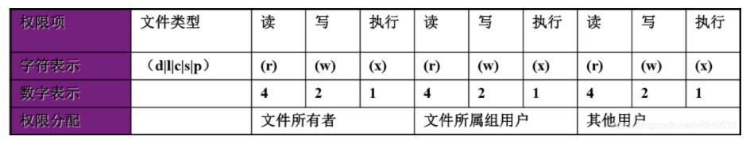
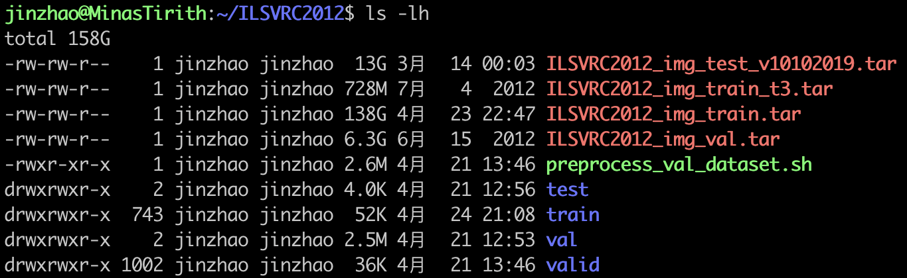

Linux的常用命令，cd，ls，rm，mkdir等等。

## 下载wget

wget是linux下一个从网络上自动下载文件的常用自由工具。它支持HTTP，HTTPS和FTP协议，可以使用HTTP代理。一般的使用方法是: wget + 空格 + 参数 + 要下载文件的url路径：

```bash
wget [] http://www.linuxsense.org/xxxx/xxx.tar.gz
```

常用参数:

* -b：后台下载，Wget默认的是把文件下载到当前目录。

* -O：将文件下载到指定的目录中。
* -P：保存文件之前先创建指定名称的目录。
* -t：尝试连接次数，当Wget无法与服务器建立连接时，尝试连接多少次。
* -c：断点续传，如果下载中断，那么连接恢复时会从上次断点开始下载。
* -r：使用递归下载

## 系统信息

- `lscpu`：查看cpu信息
- `free -m -lh`：查看内存信息
- `df -lh`：查看硬盘信息
- `du -ah --max-depth=1` ：查看当前目录下一级子文件和子目录占用的磁盘容量。
- `uname` 


## 拉高内存占用

```bash
mkdir ramfs/
mount -t ramfs ramfs ramfs/
dd if=/dev/zero of=ramfs/file bs=1G count=30
```

挂载 ramfs 文件系统（物理内存文件系统）

```bash
umount ramfs/
```


## 进程交互

* ps：查看静态的进程统计信息（一般结合选项使用 ps aux 或 ps -elf 命令）
* top：查看进程动态信息（以全屏交互式的界面显示进程排名，及时跟踪系统资源占用情况）
  交互命令：
  * M：根据内存情况进行排序
  * N：根据启动时间进行排序
  * P：根据CPU占用情况进行排序
  * Q：退出
* pgrep：查询进程信息（可以指定进程的一部分名称进行查询，通常结合 “ - l ” 选项）
* ptree：查看进程树（该命令查询的信息比较复杂，而且之前的命令完全满足我们查询进程信息的需要，所以就略过，通常使用 pstree -aup 或 pstree {用户名} 来使用）
* job：`jobs  -l`   查看当前终端中在后台运行的进程任务，并显示该进程的PID号
* kill：终止进程，格式：`kill PID`。


## 查看ls

> 参考：[总结](https://linux.cn/article-5109-1.html)

* -a：查看所有文件，包括隐藏文件
* -l：查看所有文件权限，大小(字节)，创建时间修改时间，文件名
* -lh：与上面大致相同，只不过大小使用的是MB或者GB之类的
* -R：能列出非常长的目录树
* -lS：组合选项能按文件从大到小的次序显示
* --help：帮助页面


## 打包tar

* -z ：使用 gzip 来压缩和解压文件
* -v ：--verbose 详细的列出处理的文件
* -f ：--file=ARCHIVE 使用档案文件或设备，这个选项通常是必选的
* -c ：--create 创建一个新的归档（压缩包）
* -x ：从压缩包中解出文件


解压：

* `tar –xvf filename.tar ~/path/`：解压 tar包，到文件夹
* `tar -zxvf filename.tar.gz`：解压tar.gz
* `tar -jxvf filename.tar.bz2`：解压 tar.bz2
* `tar -Zxvf filename.tar.Z`：解压tar.Z


压缩：

* `tar –cvf filename.tar * `：将目录里所有文件打包成filename.tar
* `tar –zcf filename.tar.gz *`：将目录里所有文件打包成filename.tar后，并且将其用gzip压缩，生成一个gzip压缩过的包，命名为filename.tar.gz
* `tar –jcf filename.tar.bz2 * `：将目录里所有文件打包成filename.tar后，并且将其用bzip2压缩，生成一个bzip2压缩过的包，命名为filename.tar.bz2
* `tar –Zcf filename.tar.Z *`：将目录里所有文件打包成filename.tar后，并且将其用compress压缩，生成一个umcompress压缩过的包，命名为filename.tar.Z


解压zip：`unzip [选项] 压缩包名`

* -d 目录名：将压缩文件解压到指定目录下。
* -n： 解压时并不覆盖已经存在的文件。
* -o： 解压时覆盖已经存在的文件，并且无需用户确认。
* -v：查看压缩文件的详细信息，包括压缩文件中包含的文件大小、文件名以及压缩比等，但并不做解压操作。
* -t：测试压缩文件有无损坏，但并不解压。
* -x 文件列表：解压文件，但不包含文件列表中指定的文件。


## 移动mv

* 修改文件或者文件夹的名：`mv name1 name2`

* 移动文件或者文件夹，到文件夹：`mv filename wenjianja/`

  * -f：强制覆盖，如果目标文件已经存在，则不询问，直接强制覆盖；
  * -i：交互移动，如果目标文件已经存在，则询问用户是否覆盖（默认选项）；
  * -n：如果目标文件已经存在，则不会覆盖移动，而且不询问用户；
  * -v：显示文件或目录的移动过程；
  * -u：若目标文件已经存在，但两者相比，源文件更新，则会对目标文件进行升级；

  


## 删除rm

* 删除文件：`rm [选项] 文件或目录`
  * -f：强制删除（force），和 -i 选项相反，使用 -f，系统将不再询问，而是直接删除目标文件或目录。
  * -i：和 -f 正好相反，在删除文件或目录之前，系统会给出提示信息，使用 -i 可以有效防止不小心删除有用的文件或目录。
  * -r：递归删除，主要用于删除目录，可删除指定目录及包含的所有内容，包括所有的子目录和文件。


## 复制cp

用来复制文件和目录，同时借助某些选项，还可以实现复制整个目录，以及比对两文件的新旧而予以升级等功能。

* 复制：`cp [选项] 源文件 目标文件`
  * -a：相当于 -d、-p、-r 选项的集合，这几个选项我们一一介绍；
  * -d：如果源文件为软链接（对硬链接无效），则复制出的目标文件也为软链接；
  * -i：询问，如果目标文件已经存在，则会询问是否覆盖；
  * -l：把目标文件建立为源文件的硬链接文件，而不是复制源文件；
  * -s：把目标文件建立为源文件的软链接文件，而不是复制源文件；
  * -p：复制后目标文件保留源文件的属性（包括所有者、所属组、权限和时间）；
  * -r：递归复制，用于复制目录；
  * -u：若目标文件比源文件有差异，则使用该选项可以更新目标文件，此选项可用于对文件的升级和备用。

批量复制：
```
for i in {1..20}; do cp thsample_test.tar 01/thsample_test-$i.tar; done
```


## 挂载 mount

注意，挂载移动硬盘需要使用具有root权限的账号才可以。

* 首先使用`sudo fdisk -l`，查看移动硬盘信息，连接前和连接后各使用一次，这样就可以找到移动硬盘是哪个了。
* 然后需要建立一个挂载目录，`mkdir ~/disk`，挂载了之后切入到这个目录下面就是硬盘的内容了。
* 最后使用mount命令，`sudo mount /dev/sda1 ~/disk`，此时的`disk`文件夹对于普通用户是没有写操作的权限的，需要使用`chmod`命令修改文件夹权限，`sudo chmod 777 ~/disk/`。


## 修改权限

修改权限是一个比较经常做的一个操作，比如将一个脚本变成可执行脚本，这里总结一下关于这部分的内容。

### 文件权限

这时候就要贴一个经典的图了：



把文件的权限想成二进制位，三个一组，共有三组，分别代表文件所有者（u，user），文件所属组用户（g，group）和其他用户（o，other），一组是rwx读写和执行，rwx出现就代表1，出现（-）就代表0。

最左边部分是一个单独的字符位，代表文件的类型，（-）代表普通文件，（d）代表目录，（l 小写L）代表软链接，（c）字符设备，（s）套接字。


举个例子就是，下面这样：



第一个文件最前面的部分是 `-rw-rw-r--`，分组一下就是 `-\rw-\rw-\r--`，一点点翻译就是：普通文件，文件所有者的权限是读r和写w，文件所属组用户权限是读r和写w，其他用户的权限是读r，权限代表的数字就是 $ rw- = 110_{2} = 6_{10}  $ 。


### chmod

所以修改权限的方式有两种，一种是字符形式的，一种是数字形式的，如我们想设置文件 `preprocess.sh` 的权限为 `rwxr--r--` 时：

* 字符形式：`chmod u=rwx,go=r preprocess.sh`，其中 u 代表的是文件所有者，g 代表所属组，o 代表其他人，想给他们什么权限就给出 rwx 就行，不仅可以使用符号 = （代表设定权限），还可以使用符号 +（代表加入权限），符号 -（代表删除权限）。
* 数字形式：`chmod 744 preprocess.sh`，其中所有人 $ = rwx = 4 + 2 + 1 = 7 $，所属组 = 其他人 $ = r-- = 4 + 0 + 0 = 4 $。

文件所属类型应该是改不了的。