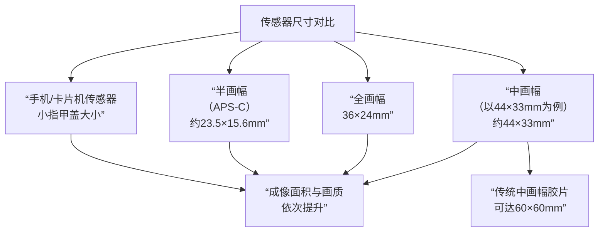

### CMOS

CMOS（Complementary Metal Oxide Semiconductor，互补金属氧化物半导体）在摄影领域，指的是相机里使用的图像传感器，是数码相机的数码底片，是成像的核心。

CMOS 传感器是一个由数百万乃至上亿个微小像素点组成的芯片。每个像素点都是一个独立的光电二极管，负责：
1. **感光**：接收通过镜头传来的光线。
2. **光电转换**：将光信号转换成电信号。
3. **输出信号**：将这些电信号进行处理和放大，最终传递给图像处理器，合成一张完整的数字照片。

CMOS 凭借以下优势最终全面取代了数码相机发展早期的另一种传感器 CCD，成为当今绝对的主流：
1. **成本更低**：制造工艺与主流集成电路兼容，易于大规模生产。
2. **功耗极低**：非常省电，这对于需要长时间续航的相机和手机至关重要。
3. **读取速度快**：允许相机实现极高的连拍速度，并且是拍摄高清视频（尤其是4K/8K）的前提。
4. **功能集成度高**：可以在传感器芯片上直接集成模拟数字转换器、降噪电路，甚至**相位检测自动对焦点**——这正是微单相机能够实现高速、全域自动对焦的物理基础。

> [!info] CCD
> CCD（Charge-Coupled Device，电荷耦合器件）是一种将光转化为电荷并进行信号传输的光电转换器件。
> 
> 其工作原理基于**光电效应**，当光线照射到 CCD 芯片上时，芯片上的光敏元件会将光信号转化为电荷信号。这些电荷信号会在芯片内部的电路控制下，按照一定顺序逐个传输，最终被转换为数字信号，经过一系列处理后形成我们看到的图像。

### ISO

ISO 用来衡量相机传感器（或胶片）对光线的敏感程度，低 ISO（如100）表示感光度低，需要很强的光线才能正确曝光；高 ISO（如 3200、6400）表示感光度高，在微弱的光线下也能捕捉到画面。

> [!tip] 曝光三角：ISO、光圈和快门速度
> 
> 1. **光圈**：控制进入相机光量的多少
> 2. **快门速度**：控制光线进入的时间长短
> 3. **ISO**：控制相机对已有光线的反应程度

#### 画质与噪点

**提高 ISO** 的主要代价是**画质下降**，具体表现为**噪点增加**。

> [!info] 噪点
> 噪点看起来就像图像上布满的彩色颗粒和杂色，类似于老式电视的雪花，会使得照片细节模糊、色彩不纯净。

你可以把相机传感器想象成一个收音机：
1. 在信号好的地方（光线充足），你把音量（ISO）调到一个正常水平，就能听到清晰的声音（得到干净的画面）。
2. 在信号弱的地方（光线不足），为了能听清，你必须调高音量（提高ISO）。但同时，你也会把背景的嘶嘶电流声（传感器本身的电子信号干扰）一起放大，这就是噪点。

#### 使用

> [!tip] 基本原则
> 在任何时候，只要条件允许，都应该使用相机原生最低的 ISO（通常是ISO 100 或 64 ），这样可以获得最纯净、细节最丰富的画质。

|ISO 设置|适用场景|画质预期|
|---|---|---|
|**100-400**|晴天户外、使用三脚架|**极佳**，细节丰富，噪点极少|
|**400-800**|阴天、明亮的室内|**很好**，几乎看不到噪点|
|**800-1600**|一般室内灯光、黄昏|**良好**，开始出现轻微噪点，但完全可用|
|**1600-6400**|昏暗的室内、夜晚街头、拍摄运动|**可用**，有明显噪点，但保证了快门速度|
|**6400以上**|极暗环境、对画质要求不高的记录|**较差**，噪点显著，细节损失，仅在必要时使用|

### 全画幅

全画幅的尺寸继承了传统 135 胶卷（$35mm$ 胶卷）的单张底片大小（约 $36mm × 24mm$），在数码时代，传感器做到这个尺寸，就被称为全画幅。

> [!tip] 像素密度与画质
> 很多人有一个误区：“我的半画幅相机有 2400 万像素，全画幅相机也有 2400 万像素，所以它们画质一样”，这是**错误**的。
>
> **关键在于像素密度**：
> - 把 2400 万像素做在小得多的半画幅传感器上，意味着每个像素点的尺寸更小。 
> - 更小的像素点，接收光线的能力更弱，在光线不足（高 ISO）时更容易产生噪点，动态范围也通常更窄。 
> 
> 所以，即使**最终输出照片的像素数量相同**，全画幅传感器的**单个像素画质**通常要优于半画幅，这就是底大一级压死人的道理。

### 半画幅

半画幅，也称为 **APS-C 画幅**，是一种尺寸小于全画幅的相机传感器规格，是目前单反和微单相机中应用最广泛、性价比最高的画幅之一。

> [!tip] 由来
> APS-C 这个名字源于一个已经停产的胶片系统**先进摄影系统（Advanced Photo System，APS）**，是上世纪90年代由几家相机巨头共同推出的一种更小巧的胶片格式，C 代表 Classic，意思是经典模式，其胶片画幅尺寸约为 $25.1mm × 16.7mm$。
>
> 数码时代沿用了这个名称和尺寸概念，用来指代尺寸相近的图像传感器。

#### 对比

1. **全画幅**：传感器的尺寸与传统 $35mm$ 胶卷的尺寸（$36mm × 24mm$）相同，被视为一个基准。
2. **半画幅**：传感器比全画幅要小，不同厂商的 APS-C 传感器尺寸有细微差别：
    - **佳能**：约 $22.3mm × 14.9mm$（裁剪系数约 1.6x）
    - **尼康、索尼、富士等**：约 $23.6mm × 15.6mm$（裁剪系数约 1.5x）

> [!caution] 核心差异
> 全画幅和半画幅最根本的区别不在于最终输出照片的**像素数量**，而在于传感器尺寸带来的**单个像素画质**、**高感表现**、**景深控制和视角差异**。

#### 裁剪系数

当你把一个为全画幅相机设计的镜头（例如一枚 $50mm$ 标准镜头）安装在 APS-C 机身上时，因为传感器更小，它只能捕捉到镜头成像圈中央的一部分画面，就好像把全画幅的照片边缘**裁剪**掉了一样，所带来的视觉效果就是**焦距变长**了。

计算公式
$$
等效焦距 ≈ 镜头实际焦距 × 裁剪系数
$$

#### 优点

1. **性价比高**：APS-C 相机和镜头通常比全画幅系统便宜很多，是摄影入门和爱好者的绝佳选择。
2. **体积小巧轻便**：相机机身和镜头都可以做得更小、更轻，非常适合旅行、街拍和日常携带。
3. **长焦优势**：由于裁剪系数的存在，在拍摄野生动物、体育等需要长焦的场景时，可以用更短的焦距实现更长的等效焦距，节省了购买超长焦镜头的费用。  
    - 例如，一支 $300mm$ 的镜头在 APS-C 上等效于 $450mm$ 或 $480mm$

#### 缺点

1. **高感光度画质稍弱**：在弱光环境下，使用高 ISO 拍摄时，由于单个像素点接收的光线较少，画质（主要是噪点控制）通常不如同代技术的全画幅传感器。
2. **景深和虚化**：在相同构图和光圈下，APS-C 产生的背景虚化效果不如全画幅强烈。（但这不完全是缺点，有时拍摄风景时反而需要更深的景深）。
3. **超广角劣势**：想要获得超广角视角（如等效 $16mm$）会更有挑战，需要购买专门为 APS-C 设计的、实际焦距非常短的超广角镜头（如 $10-18mm$）。

#### 主要品牌

1. **佳能**：其 APS-C 单反系列称为 **APS-C**，微单系列称为 **EF-M**（已基本被 RF 系统取代）和 **RF-S**（新一代）。
2. **尼康**：其 APS-C 单反系列称为 **DX**，微单系列称为 **DX**。
3. **索尼**：其 APS-C 微单系列称为 **E-mount**，使用 **E** 卡口镜头（全画幅微单叫 FE 卡口，但机身通用）。
4. **富士**：**专注于 APS-C 画幅**，其 X 系列相机和 XF 镜头群非常庞大和成熟，是 APS-C 系统的标杆之一。

### 中画幅

中画幅的传感器尺寸**比全画幅更大**，对应 120/220 胶卷，尺寸有多种：$60mm×45mm$、$60mm×60mm$、$60mm×70mm$ 等。

> [!tip]
> 中画幅是为那些愿意为了最后 $1\%$ 的画质提升，付出 $100\%$ 代价的完美主义者准备的终极武器。

#### 主要品牌

1. **哈苏**：中画幅领域的王者，以极致的画质和昂贵的价格著称，是登月相机品牌。
2. **飞思**：另一个顶级品牌，专注于数码后背和商业摄影系统，画质标杆。
3. **富士**：**中画幅的普及者**，其 GFX 系列（如 GFX100 II、GFX50S II）以微单的形式将中画幅的门槛大幅降低，提供了相对出色的便携性和性价比，让更多摄影师能够触及中画幅。
4. **宾得**：依然在生产单反结构的中画幅相机，比较传统。

### 大画幅

使用更大的单张页片，如 4×5 英寸、8×10 英寸。

