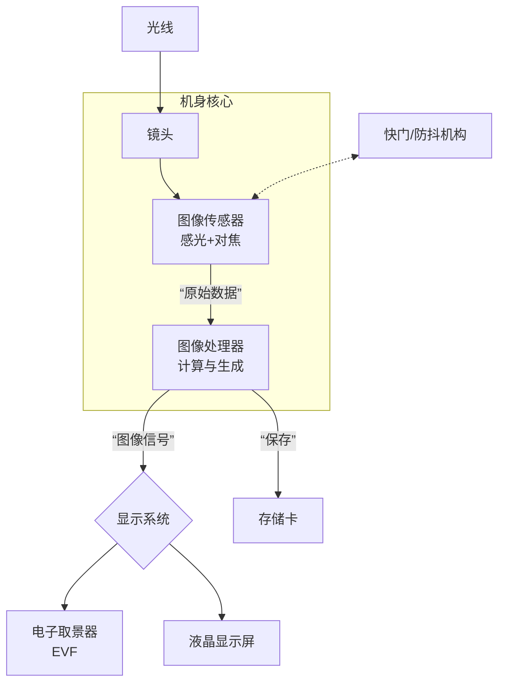

 
## 胶片相机

胶片相机是一种使用**感光胶片**来记录影像的相机，在数码相机诞生之前，所有相机都是胶片相机。它与数码相机最根本的区别在于：它没有图像传感器（CMOS/CCD），也没有内存卡，它的**成像介质是一张涂有感光化学材料的胶片**。

### 成像原理

胶片成像是一个**光化学过程**，它依赖于光线与胶片上的感光材料发生化学反应，整个过程可以分为三个核心阶段：
1. **曝光**：按下快门的瞬间发生，
	- **光线进入**：光线通过相机的镜头，汇聚成像。
	- **快门开启**：当你按下快门按钮时，相机快门会打开一个预先设定的短暂时间（如1/125秒），让光线进入相机内部。
	- **胶片感光**：光线照射到胶片上。胶片的基础是**片基**（通常是塑料），上面涂有一层充满了**卤化银晶体**的感光乳剂。
	- **形成“潜影”**：卤化银晶体在受到光线照射后，会发生一种极其微妙的、不可见的化学变化，形成一个 **“潜影”** 。你可以把它理解为一个**看不见的图像蓝图**，它已经记录了场景的所有明暗和轮廓信息，但还没有任何方法能直接看到它。

2. **显影**：必须在全黑的暗房或使用不透光的显影罐完成，
	- **显影液**：将曝光后的胶片浸入**显影液**中。显影液是一种化学试剂，它的作用是**还原**那些已经感光（带有潜影）的卤化银晶体，将其中的银离子变成黑色的**金属银颗粒**。
	    - **哪里光线强，哪里感光就多，还原的金属银就多，区域就越黑。**
	- **得到“负像”**：经过显影后，胶片上原来感光的地方变成了不透明的金属银，原来暗的地方则没有变化。这样，我们得到了一个**明暗与实际场景完全相反**的影像，这就是我们常说的 **“底片”** 或 **“负片”**。天空是黑的，阴影是透明的。

3. **定影**：在暗房中完成，
	- **定影液**：将显影后的胶片浸入**定影液**中。定影液的作用是**溶解并去除**那些没有感光、因此也没有被显影液还原的卤化银晶体。
	- **固定影像**：经过定影，胶片上只留下了稳定的金属银构成的图像。之后即使再见到光线，影像也不会改变了。此时，胶片对光线不再敏感，可以拿出来在正常光线下观看了

4. **印相**：底片是负像，而且通常很小，我们需要通过印相来得到正像的最终照片。
	- 将底片和一张**相纸**（相纸上也涂有感光乳剂）叠在一起，放入放大机下曝光。
	- 光线透过底片，底片上黑（金属银多）的地方阻挡的光线多，相纸上对应区域感光就少；底片上透明的地方透过光线多，相纸上对应区域感光就多。
	- 然后，对曝光后的相纸进行**又一次的显影和定影**。
    - 这次，在相纸上得到的影像，其明暗关系就与原始场景一致了，这就是我们拿在手里的**最终照片**。

## 单反

单反，全称是单镜头反光相机。其拍摄和取景都使用同一个镜头，机身内部有一块像小镜子一样的反光板。

### 工作流程

1. 光线通过镜头进入相机。
2. 光线被机身内的**反光板**向上反射。
3. 反射的光线抵达机顶的**五棱镜**（一个多面镜），经过多次折射。
4. 最后，光线通过**光学取景器**进入你的眼睛。

**当按下快门时**：
1. 反光板瞬间迅速向上翻起。
2. 快门帘幕打开，光线直接照射到传感器上进行成像。
3. 成像结束后，反光板落回原位。

### 主要特点

1. **光学取景器**：你看到的是真实的光线，无延迟、无耗电、色彩自然。
2. **体积和重量**：由于需要容纳反光板和五棱镜，机身通常更厚、更重。
3. **对焦系统**：传统单反有独立的**相位检测对焦模块**，位于机身底部。在光学取景状态下对焦速度极快，尤其适合拍摄运动物体。

## 微单（无反）

微单，官方和更通用的名称是无反相机，意思是**没有反光镜的可换镜头相机**，其取消了单反相机中核心的反光板结构。
### 工作流程

1. 光线通过镜头，**直接照射**在图像传感器上。
2. 传感器将捕捉到的图像信号实时传递到机身后的屏幕或电子取景器上。
3. 你从电子取景器或屏幕上看到的，就是传感器“看到”的画面，也就是最终成像的预览。

### 主要特点

1. **电子取景器**：你看到的是一个电子屏幕的预览。可以看到曝光、白平衡、滤镜效果的实时预览。有一定延迟和耗电。
2. **体积和重量**：由于取消了反光镜和五棱镜结构，机身可以做得更薄、更小、更轻。
3. **对焦系统**：对焦完全通过传感器本身完成（片上相位检测/对比度检测）。对焦点可以覆盖几乎整个画面，人脸/动物/眼睛追踪对焦功能非常强大且精准。
4. **视频性能**：天生结构更适合视频拍摄，对焦、防抖等性能在视频模式下表现更佳。

### 核心结构

1. **成像系统**
	- **图像传感器**：这是相机的“数码胶片”，是**最核心**的元件，负责将镜头捕捉到的光线信号转换为电信号，传感器的尺寸（如APS-C、全画幅）和品质直接决定了画质的基础（细节、高感光度表现、动态范围）。
	- **图像处理器**：这是相机的“大脑”，负责接收传感器传来的海量数据，进行运算，最终生成一张数字照片或视频文件。它决定了相机的色彩科学、连拍速度、高感降噪能力以及各种智能功能（如人脸识别）的速度。
	- **镜头卡口**：连接机身和镜头的接口，确保了镜头能精准地固定在正确的位置上，并与机身进行高速的数据通信（传输对焦、光圈等信息）。
	    - **特点**：微单的卡口直径通常更大，**法兰距**（卡口到传感器的距离）非常短，这有利于设计出光学素质更高、边缘画质更好的镜头。

2. **取景与显示系统**：微单用一套完整的电子系统来替代光学取景器
	- **电子取景器**：一个微型的高分辨率显示屏，通过它看到的是图像传感器实时捕捉到的画面。实现了所见即所得——你看到的曝光、色彩、景深效果就是最终成片的效果。
	- **液晶显示屏**：机背的主屏幕，功能与EVF相同，用于取景、操作菜单和回放照片。

3. **对焦系统**：
	- **片上对焦系统**：对焦检测单元**直接集成在图像传感器上**，
		- 主要有两种技术：
	        1. **片上相位检测对焦**：在传感器上埋藏专用的相位检测像素，能像单反的独立对焦模块一样快速判断合焦状态。
	        2. **对比度检测对焦**：通过传感器读取的画面对比度变化来寻找最清晰的对焦点，精度极高。
	    - **优势**：因为对焦点分布在传感器上，所以**对焦点可以覆盖几乎整个画面**，没有死角。这使得强大的人眼/动物眼追踪、物体追踪对焦成为可能。

4. **快门与防抖系统**：
	- **快门机构**：
		- **机械快门**：与传统相机类似，通过前后帘幕的移动来控制曝光时间。
		- **电子快门**：直接通过传感器通断电来“扫描”记录画面，完全无声，速度可以极快，但可能会有果冻效应。
		- **电子前帘快门**：一种混合模式，结合了两者的优点，是目前最常用的模式。
	- **机身防抖系统**
	    - **功能**：微单结构为在机身内加入防抖机制提供了空间。通过传感器位移机构，传感器本身可以进行微小移动来补偿手持拍摄时的抖动。
	    - **优势**：可以实现与镜头光学防抖协同工作（协同防抖），大幅提升手持拍摄的成功率。这意味着即使使用没有防抖的老镜头，也能获得一定的防抖效果。

## 旁轴相机

旁轴相机的最大特点是**取景光路独立于成像光路**。

### 工作原理

**旁轴**：指的是取景器的光轴在镜头光轴的旁边，二者是平行的。
1. 相机机身有一个独立的**取景窗口**，你通过这个窗口看到的景象，并非通过镜头捕捉的，而是一个独立的、近似的视野。
2. 镜头成像的光线，则直接照射到后方的胶片或传感器上。

### 主要特点

1. **取景器不通过镜头**：你看到的画面和最终拍到的画面存在细微差别，这个现象叫做 **“视差”** ，在近距离拍摄时尤其明显。
2. **安静、无震**：因为没有单反相机那种需要快速抬升和落下的反光板，所以快门声音非常轻，振动也很小。
3. **结构紧凑**：取消了反光镜箱和五棱镜，机身可以做得非常扁平和小巧。
4. **对焦方式**：经典旁轴相机通常采用联动测距对焦。对焦时，取景器中央会出现一个重影，当转动对焦环使重影合一时，即表示对焦成功。这是一种非常精密和富有魅力的对焦方式。

