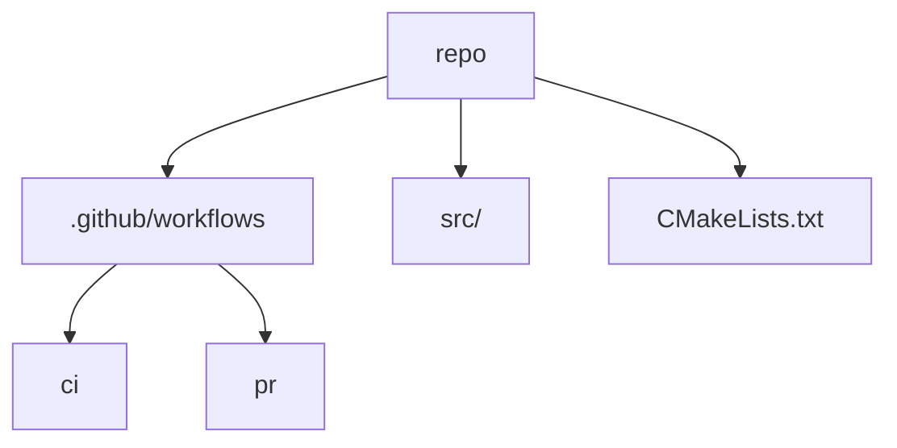
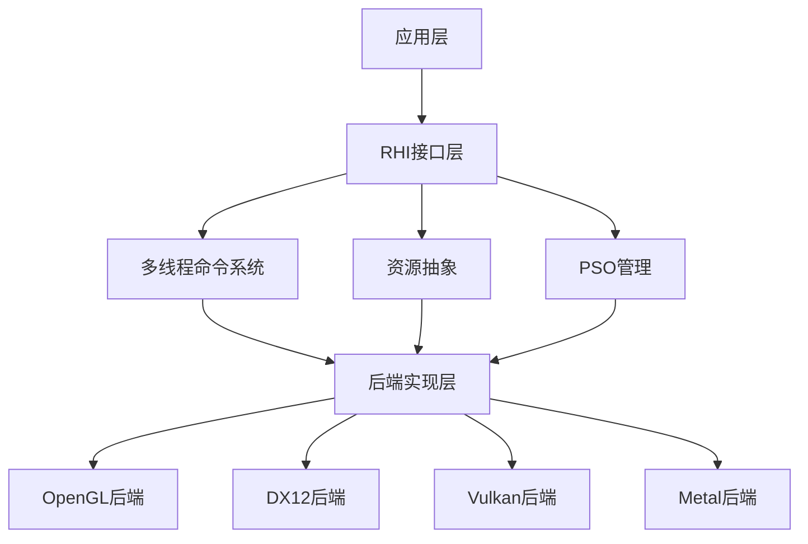
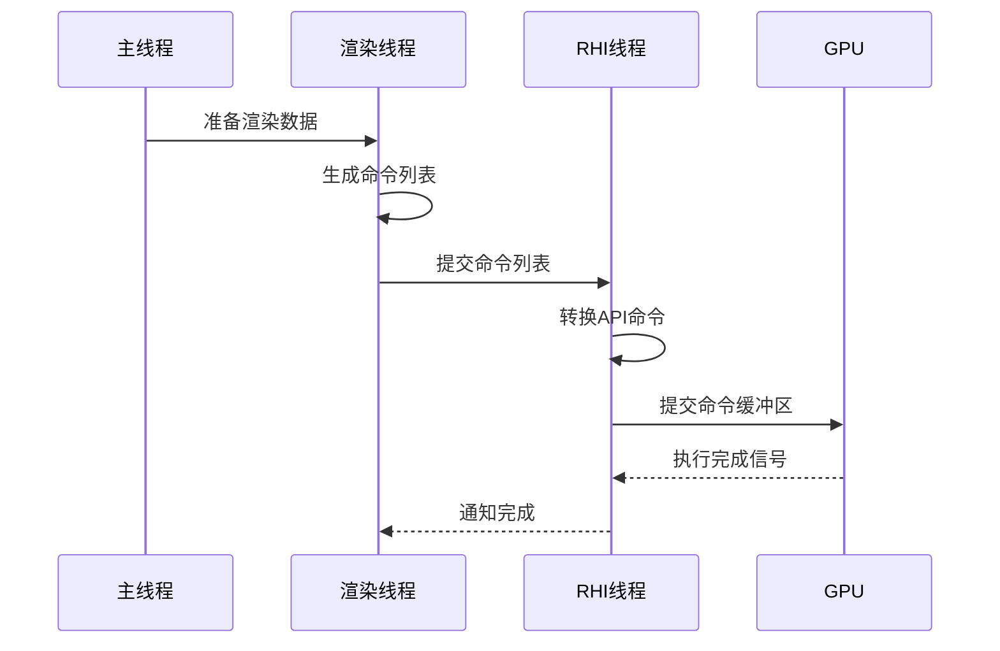
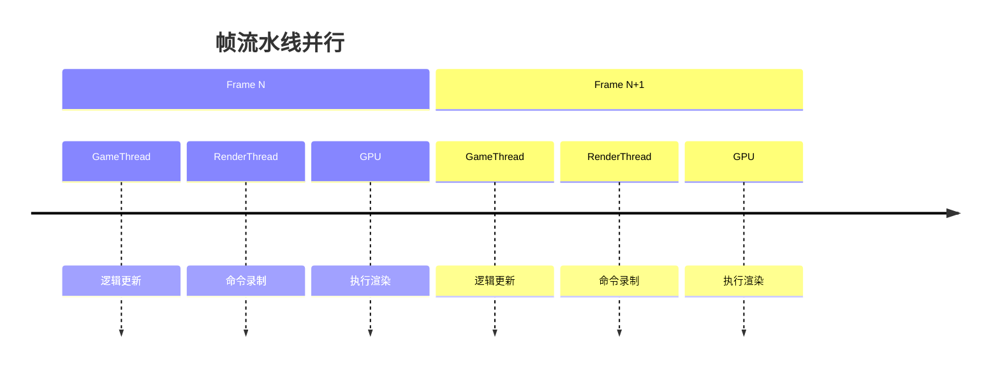

## Tasks


## 跨平台编译



1. **项目结构**：
```
JzRE/
├── .github/
│   └── workflows/
│       └── ci.yml          # CI 流水线
├── JzRE/                   # 项目源码
├── CMakeLists.txt          # 主构建文件
├── vcpkg.json              # 依赖声明
└── README.md
```

2. **安装 [vcpkg](../../Language/C++/构建/vcpkg.md)**
```bash
git clone https://github.com/microsoft/vcpkg
./vcpkg/bootstrap-vcpkg.bat   # Windows
./vcpkg/bootstrap-vcpkg.sh    # Linux & macOS
```

3. **`vcpkg.json`**
```json
{
	"name": "render-engine",
	"version": "1.0.0",
	"dependencies": [
		"glfw3",
		"glad",
		"imgui[glfw-binding,opengl3-binding]",
		"glm"
	],
	"builtin-baseline": "3426db05b996481ca31e95fff3734cf23e0f51bc" # 锁定基线版本
}
```

4. **`CMakeLists.txt`**
```cmake
cmake_minimum_required(VERSION 3.20)

project(RenderEngine)

# 设置 C++ 标准
set(CMAKE_CXX_STANDARD 17)
set(CMAKE_CXX_STANDARD_REQUIRED ON)

# 查找依赖包
find_package(glfw3 CONFIG REQUIRED)
find_package(glad CONFIG REQUIRED)
find_package(imgui CONFIG REQUIRED)
find_package(glm CONFIG REQUIRED)

# 平台特定设置
if(WIN32)
    # Windows 特定设置
    add_definitions(-D_WIN32_WINNT=0x0A00)
elseif(APPLE)
    # macOS 特定设置
    find_library(COCOA_LIBRARY Cocoa)
    find_library(OPENGL_LIBRARY OpenGL)
    find_library(IOKIT_LIBRARY IOKit)
    find_library(COREVIDEO_LIBRARY CoreVideo)
elseif(UNIX)
    # Linux 特定设置
    find_package(X11 REQUIRED)
    find_package(Threads REQUIRED)
endif()

# 添加可执行文件
add_executable(JzRE src/main.cpp)

# 链接库
target_link_libraries(JzRE PRIVATE
    glfw
    glad::glad
    imgui::imgui
    glm::glm
)
```

6. **GitHub Actions 流水线配置（`.github/workflows/build.yml`）**
```yaml
name: Cross-Platform Build

on: [push, pull_request]

jobs:
  build:
    strategy:
      matrix:
        os: [ubuntu-22.04, windows-latest, macos-latest]
        build_type: [Debug, Release]
    
    runs-on: ${{ matrix.os }}
    
    steps:
    - name: Checkout code
      uses: actions/checkout@v3
        
    - name: Install system dependencies
      if: matrix.os == 'ubuntu-22.04'
      run: |
        sudo apt-get update
        sudo apt-get install -y libx11-dev libxi-dev libgl1-mesa-dev
        
    - name: Bootstrap vcpkg
      run: |
        cd vcpkg
        if [ "$RUNNER_OS" == "Windows" ]; then
          ./bootstrap-vcpkg.bat
        else
          ./bootstrap-vcpkg.sh
        fi
        cd ..
        
    - name: Install CMake
      uses: jwlawson/actions-setup-cmake@v1
      with:
        cmake-version: '3.25.1'
        
    - name: Configure CMake
      run: |
        cmake -B build -DCMAKE_BUILD_TYPE=${{ matrix.build_type }}
        
    - name: Build project
      run: |
        cmake --build build --config ${{ matrix.build_type }} --parallel 4
        
```


### 使用

1. **克隆仓库**
```bash
git clone https://github.com/your/repo.git
```

2. **生成构建系统**
```bash
cmake -DCMAKE_BUILD_TYPE=Debug \
      -DCMAKE_TOOLCHAIN_FILE=$VCPKG_ROOT$/scripts/buildsystems/vcpkg.cmake \
      -DVCPKG_TARGET_TRIPLET=x64-mingw-static \
      -B build \
      -S . \
      -G "MinGW Makefiles"
```

3. **编译项目**
```bash
cmake --build build
```

## RHI



### 核心组件实现

1. **动态RHI接口（`DynamicRHI.h`）**
```cpp
// 基础资源接口
class IRHIResource {
public:
    virtual ~IRHIResource() = default;
    virtual void SetDebugName(const char* name) = 0;
};

// 命令列表接口
class IRHICommandList {
public:
    virtual void BeginFrame() = 0;
    virtual void EndFrame() = 0;
    
    virtual void SetPipelineState(IRHIPipelineState* pso) = 0;
    virtual void Draw(uint32_t vertexCount) = 0;
    // ... 其他绘图命令
};

// 动态RHI主接口
class IDynamicRHI {
public:
    // 初始化
    virtual bool Init(void* nativeWindow) = 0;
    
    // 资源创建
    virtual IRHIBuffer* CreateBuffer(const BufferDesc& desc) = 0;
    virtual IRHITexture* CreateTexture(const TextureDesc& desc) = 0;
    virtual IRHIPipelineState* CreatePipelineState(const PSODesc& desc) = 0;
    
    // 命令列表
    virtual IRHICommandList* CreateCommandList() = 0;
    virtual IRHICommandList* GetImmediateCommandList() = 0;
    
    // 多线程支持
    virtual void SubmitCommandLists(IRHICommandList** lists, uint32_t count) = 0;
};
```


2. **多线程命令系统（`RHICommandSystem.cpp`）**
```cpp
// 命令处理器 (RHI线程)
class RHICommandProcessor {
    std::queue<IRHICommandList*> m_CommandQueue;
    std::mutex m_QueueMutex;
    std::condition_variable m_CondVar;
    
public:
    void EnqueueCommandList(IRHICommandList* cmdList) {
        std::lock_guard<std::mutex> lock(m_QueueMutex);
        m_CommandQueue.push(cmdList);
        m_CondVar.notify_one();
    }
    
    void ProcessCommands() {
        while (true) {
            std::unique_lock<std::mutex> lock(m_QueueMutex);
            m_CondVar.wait(lock, [&]{ return !m_CommandQueue.empty(); });
            
            auto cmdList = m_CommandQueue.front();
            m_CommandQueue.pop();
            lock.unlock();
            
            // 执行命令列表
            cmdList->Execute();
            
            // 回收资源
            cmdList->MarkCompleted();
        }
    }
};

// 延迟命令列表实现
class DeferredCommandList : public IRHICommandList {
    std::vector<Command> m_Commands;  // 命令存储
    RHICommandProcessor* m_Processor;
    
public:
    void SetPipelineState(IRHIPipelineState* pso) override {
        m_Commands.push_back(Command::MakeSetPSO(pso));
    }
    
    void Submit() override {
        m_Processor->EnqueueCommandList(this);
    }
    
    void Execute() override {
        for (auto& cmd : m_Commands) {
            cmd.Execute(); // 实际执行命令
        }
    }
};
```

3. **PSO管理（`PipelineStateCache.cpp`）**：资源管理：管理纹理/缓冲区/管线状态对象
```cpp
class PipelineStateCache {
    struct PSOCacheEntry {
        PSODesc desc;
        std::unique_ptr<IRHIPipelineState> pso;
        size_t hash;
    };
    
    std::unordered_map<size_t, PSOCacheEntry> m_Cache;
    std::mutex m_CacheMutex;
    
public:
    IRHIPipelineState* GetOrCreatePSO(const PSODesc& desc) {
        size_t hash = ComputeHash(desc);
        
        std::lock_guard<std::mutex> lock(m_CacheMutex);
        auto it = m_Cache.find(hash);
        if (it != m_Cache.end()) {
            return it->second.pso.get();
        }
        
        // 创建新PSO
        auto pso = GDynamicRHI->CreatePipelineState(desc);
        m_Cache[hash] = {desc, std::move(pso), hash};
        return m_Cache[hash].pso.get();
    }
    
private:
    size_t ComputeHash(const PSODesc& desc) {
        // 计算唯一哈希值（包含VS/PS等所有状态）
    }
};
```


4. **跨平台后端实现** (以Vulkan为例)
```cpp
// Vulkan资源实现
class VulkanTexture : public IRHITexture {
    VkImage m_Image;
    VkImageView m_ImageView;
    // ...
};

// Vulkan命令列表
class VulkanCommandList : public IRHICommandList {
    VkCommandBuffer m_CmdBuffer;
    
public:
    void SetPipelineState(IRHIPipelineState* pso) override {
        auto vkPSO = static_cast<VulkanPipelineState*>(pso);
        vkCmdBindPipeline(m_CmdBuffer, 
                         VK_PIPELINE_BIND_POINT_GRAPHICS, 
                         vkPSO->GetVkPipeline());
    }
    
    void Draw(uint32_t vertexCount) override {
        vkCmdDraw(m_CmdBuffer, vertexCount, 1, 0, 0);
    }
};

// Vulkan动态RHI实现
class VulkanDynamicRHI : public IDynamicRHI {
    VkInstance m_Instance;
    VkDevice m_Device;
    VkQueue m_GraphicsQueue;
    
public:
    bool Init(void* nativeWindow) override {
        // 初始化Vulkan实例、设备等
        // 创建交换链
        return true;
    }
    
    IRHITexture* CreateTexture(const TextureDesc& desc) override {
        return new VulkanTexture(desc, m_Device);
    }
    
    IRHICommandList* CreateCommandList() override {
        return new VulkanCommandList(m_Device);
    }
};
```


### 多线程渲染流程



1. **线程模型**：
```cpp
enum class RHIThreadMode {
    SingleThread,     // 主线程执行所有操作
    RenderThreadOnly, // 渲染线程记录命令
    DedicatedRHI      // 独立RHI线程（推荐）
};
```

2. **资源生命周期管理**：
```cpp
class RHIResourceTracker {
    std::vector<IRHIResource*> m_PendingDeletion[RHI_FRAME_COUNT];
    
public:
    void MarkForDeletion(IRHIResource* res) {
        m_PendingDeletion[CurrentFrame].push_back(res);
    }
    
    void ReleaseCompletedFrames() {
        for (auto res : m_PendingDeletion[SafeFrame]) {
            delete res;
        }
    }
};
```

3. **跨平台统一着色器处理**：
```cpp
class ShaderCompiler {
public:
    CompiledShader Compile(const ShaderSource& source, RHIBackend backend) {
        switch (backend) {
        case RHIBackend::Vulkan:
            return CompileToSPIRV(source);
        case RHIBackend::DX12:
            return CompileToDXIL(source);
        case RHIBackend::Metal:
            return CompileToMetalIR(source);
        }
    }
};
```


#### 帧间并行处理



