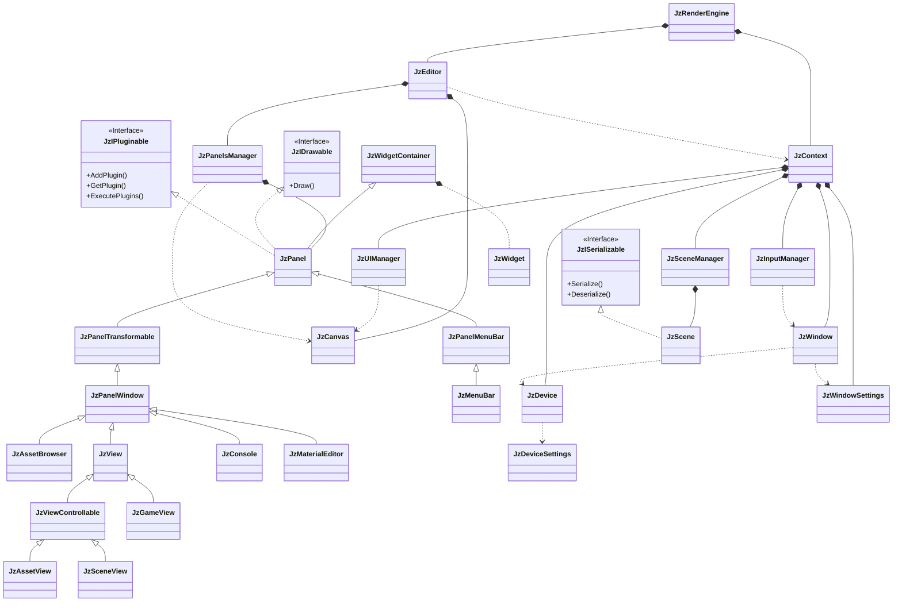

参考 Overload，为项目添加 UI，主要封装 [Dear ImGui](../../../Computer%20Graphics/Graphic%20UI/Dear%20ImGui.md) 

```mermaid
classDiagram
    direction TB

    %% Interfaces
    class JzISerializable {
        <<Interface>>
        +Serialize()
        +Deserialize()
    }

    class JzIDrawable {
        <<Interface>>
        +Draw()
    }

    class JzIPluginable {
        <<Interface>>
        +AddPlugin()
        +GetPlugin()
        +ExecutePlugins()
    }

    %% Core Engine Classes
    class JzRenderEngine { }

    class JzContext { }

    class JzDevice { }

    class JzWindow { }

    class JzInputManager { }

    JzRenderEngine *-- JzContext
    JzContext *-- JzDevice
    JzContext *-- JzWindow
    JzContext *-- JzInputManager

    %% Editor Related Classes
    class JzEditor { }

    class JzCanvas { }

    class JzPanelsManager { }

    JzRenderEngine *-- JzEditor
    JzEditor *-- JzCanvas
    JzEditor *-- JzPanelsManager
    JzEditor ..> JzContext

    %% UI Related Classes
    class JzUIManager { }

    class JzWidgetContainer { }

    class JzPanel { }

    class JzWidget { }

    JzContext *-- JzUIManager
    JzUIManager ..> JzCanvas
    JzWidgetContainer *.. JzWidget

    %% UI PANEL Related Classes
    class JzPanelMenuBar { }

    class JzMenuBar { }

    class JzPanelTransformable { }

    class JzPanelWindow { }

    class JzAssetBrowser { }

    class JzView { }

    class JzViewControllable { }

    class JzAssetView { }

    class JzSceneView { }

    class JzGameView { }

    class JzConsole { }

    class JzMaterialEditor { }

    JzPanelsManager *-- JzPanel
    JzWidgetContainer <|-- JzPanel
    JzIDrawable <|.. JzPanel
    JzIPluginable <|.. JzPanel

    JzPanel <|-- JzPanelMenuBar
    JzPanelMenuBar <|-- JzMenuBar
    JzPanel <|-- JzPanelTransformable
    JzPanelTransformable <|-- JzPanelWindow
    JzPanelWindow <|-- JzView
    JzView <|-- JzViewControllable
    JzViewControllable <|-- JzAssetView
    JzViewControllable <|-- JzSceneView
    JzPanelWindow <|-- JzAssetBrowser
    JzView <|-- JzGameView
    JzPanelWindow <|-- JzConsole
    JzPanelWindow <|-- JzMaterialEditor

    %% SCENE SYSTEM
    class JzSceneManager { }
    class JzScene { }

    JzContext *-- JzSceneManager
    JzSceneManager *-- JzScene
    JzISerializable <|.. JzScene

    %% SETTINGS
    class JzWindowSettings { }
    class JzDeviceSettings { }

    JzContext *-- JzWindowSettings
    JzDevice ..> JzDeviceSettings
    JzWindow ..> JzWindowSettings
    JzWindow ..> JzDevice
    JzInputManager ..> JzWindow
    JzPanelsManager ..> JzCanvas
```

