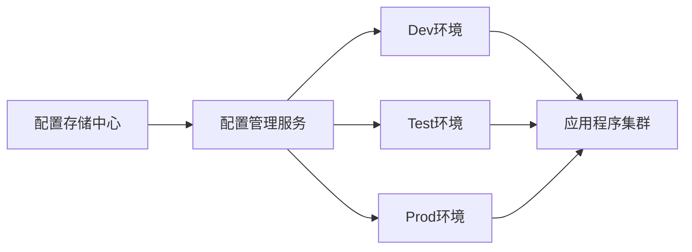

构建多环境配置管理平台（Dev/Test/Prod）需遵循环境隔离、安全管控、自动化部署、版本控制四大原则。

## 架构设计




## 核心组件与实现步骤

### 配置存储中心

1. **存储选型**：
    - **Git仓库**：存储明文配置（推荐 [GitLab](../../DevOps/Code%20Version/GitLab.md) / [GitHub](../../DevOps/Code%20Version/GitHub.md)），按分支管理环境（如 `dev` / `test` / `main` ）
    - **加密方案**：敏感数据（API 密钥、数据库密码）使用 `HashiCorp Vault` 或 `AWS Secrets Manager` 加密
    - **云服务**：AWS AppConfig、Azure App Configuration、GCP Secret Manager

2. **目录结构示例**：
```
config-repo/
├── dev/
│   ├── app-config.yaml
│   └── db-secrets.encrypted
├── test/
├── prod/
└── .gitlab-ci.yml  # 自动化流水线
```


### 配置管理服务

1. **核心功能**：
    - 环境隔离：通过 `namespace` 或 `profile` 隔离配置（如 Spring Cloud Config ）
    - 动态更新：支持运行时热加载（如 Consul、Nacos ）
    - 权限控制：RBAC 模型（如 Keycloak 集成）

2. **工具选型**：
    - **开源**：Apache [ZooKeeper](../../Backend/分布式中间件/ZooKeeper.md)、[etcd](../../Backend/分布式中间件/etcd.md)、Spring Cloud Config
    - **商业**：HashiCorp Consul、Alibaba [Nacos](../../Backend/架构设计/Nacos.md)


### 环境安全策略

| 环境   | 访问权限    | 加密要求    | 部署方式  |
| ---- | ------- | ------- | ----- |
| Dev  | 开发组全员   | 部分加密    | 自动部署  |
| Test | QA+开发组长 | 完全加密    | 手动触发  |
| Prod | 运维+安全团队 | 完全加密+审计 | 审批后部署 |

### 自动化与版本控制

1. **CI/CD流水线**（ [GitLab CI](../../DevOps/CICD/GitLab%20CI.md) 示例）：
```yaml
deploy_dev:
  stage: deploy
  only:
    - dev
  script:
    - ansible-playbook deploy-dev.yaml --extra-vars "@config/dev/settings.json"

deploy_prod:
  stage: deploy
  only:
    - main
  when: manual  # 手动审批
  script:
    - vault decrypt prod/secrets.enc
    - kubectl apply -f k8s/prod
```

2. **版本控制要求**：
    - 所有配置变更通过 PR/MR 提交
    - 生产环境配置变更需关联 JIRA 工单
    - 使用 Git Tag 标记发布版本

### 审计与监控

1. **审计日志**：
    - 记录配置修改人、时间、环境（ELK / Splunk 收集）
    - Git 历史作为变更追溯依据

2. **监控告警**：
    - 配置漂移检测（如 Ansible Tower ）
    - 敏感操作实时告警（如 Vault 审计日志）

## 关键注意事项

1. **零信任安全**：
    - 生产环境配置禁止本地存储
    - 使用短期动态凭证（如 Vault 动态数据库密码）

2. **配置漂移预防**：
    - 通过 IaC（基础设施即代码）固化环境
    - 定期扫描配置差异（Diff 工具）

3. **灾备恢复**：
    - 配置仓库多地备份
    - 保留最近 10 个可回滚版本

4. **开发体验优化**：
    - 提供本地模拟环境（如 Docker Compose 加载 Dev 配置）
    - 配置变更实时通知（Slack）