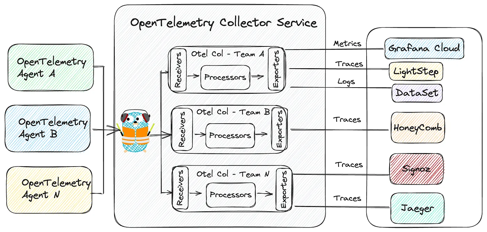

全链路追踪的本质是通过唯一ID串联分布式调用，就像给快递包裹贴运单号全程跟踪。

## 核心概念

1. **Trace（追踪/调用链）**：代表一个完整业务请求的端到端执行路径，包含多个 Span。
2. **Span（跨度）**：代表一个工作单元。通常是：
    - 一个服务内部的单个操作（如函数调用、数据库查询、HTTP请求）。
    - 一个服务对另一个服务的调用。
    - 一个服务内部多个操作的组合。
3. **Trace ID**：全局唯一的标识符，贯穿整个请求链路的所有服务。所有属于同一个请求的 Span 共享同一个 Trace ID。
4. **Span ID**：当前 Span 的唯一标识符。
5. **Parent Span ID**：标识当前 Span 是由哪个 Span 触发的（调用方Span的ID），根 Span 的 Parent Span ID 为空。
6. **Annotations/Tags/Attributes**：附加在 Span 上的元数据，用于记录关键信息（如 HTTP 状态码、数据库查询语句、错误信息、自定义业务标签）。
7. **Logs**：附加在 Span 上的时间戳日志事件（如异常堆栈）。
8. **Context Propagation （上下文传播）**：将 Trace ID，Span ID，采样标志等信息从调用方传递到被调用方的机制（通常通过 HTTP Headers、gRPC Metadata、消息队列属性等）。


## 设计目标与原则

- **低侵入性**：对应用代码影响尽可能小，优先使用 Agent/Instrumentation 自动埋点。
- **低开销**：追踪本身对应用性能（CPU、内存、网络）的影响要最小化（采样是关键）。
- **高扩展性**：支持大规模服务和海量追踪数据的收集、存储、查询。
- **高可靠性**：追踪数据收集和上报不能阻塞主业务流程。
- **端到端**：覆盖所有关键组件（前端、网关、微服务、中间件、数据库、缓存、消息队列、第三方服务）。
- **标准化**：遵循 [OpenTelemetry](../../DevOps/Monitoring/OpenTelemetry.md) 等行业标准。
- **可关联性**：能方便地将追踪数据与日志、指标关联起来。


## 关键组件设计

1. **埋点（Instrumentation）**：
    - **自动埋点**：（**首选方案**）利用语言特定的 Agent（Java Agent，.NET Profiler，Node.js/ Python/Go 的 OTel SDK）自动拦截常见框架/库（HTTP 客户端/服务器、gRPC、SQL 驱动、Redis / Memcached 客户端、Kafka/RabbitMQ 生产者/消费者等）的**调用点**，创建 Span 并注入/提取上下文。
	    - 例如：OpenTelemetry Instrumentation Libraries。
    - **手动埋点**：对于自动埋点无法覆盖的自定义逻辑或核心业务操作，需要在代码中显式创建 Span 并记录关键信息（业务标签、错误、日志）。
    - **上下文传播**：确保在服务间调用（HTTP，gRPC，RPC）、异步消息传递时，正确地将 `traceparent` （W3C Trace Context） 或 `b3` （Zipkin）等标准 Header 注入请求或消息中，并在接收方提取。

2. **数据收集（Collector）**：
    - **Agent/SDK**：运行在应用进程内或旁路（如 DaemonSet ），负责生成 Span 数据。
    - **Collector**：（**推荐**）独立的中间层服务（如 OpenTelemetry Collector），接收来自 Agents/SDKs 的 Span 数据（支持多种协议：OTLP，Jaeger，Zipkin）。提供以下核心功能：
        - **接收**：多协议支持。
        - **处理**：过滤（基于属性）、采样（尾部采样更优）、添加/修改属性、数据脱敏、批处理。
        - **导出**：将处理后的数据推送到一个或多个后端存储系统，解耦 Agent 和后端存储。
    - **直连**：Agent/SDK 直接将数据发送到后端存储（不推荐用于生产环境大规模部署，缺乏缓冲和统一处理能力）。

3. **数据传输**：
    - **协议**：优先使用 **OTLP（gRPC/HTTP）** 作为标准协议，兼容 Jaeger、Zipkin 协议也很常见。
    - **方式**：通常使用异步、非阻塞的方式上报数据（如 gRPC 流、HTTP Post 批处理），避免阻塞应用主线程。

4. **数据存储（Storage Backend）**：
    - **要求**：高吞吐写入、高效按 Trace ID 查询、支持按标签/属性过滤、一定时间窗口的存储（TTL）。
    - **常见选择**：
        - [**Elasticsearch**](../../DevOps/Logging/Elasticsearch.md)：强大灵活的搜索和分析能力，社区支持好，但资源消耗大，运维复杂。
        - **Jaeger**：自带存储（Cassandra，Elasticsearch，Kafka+Badger/OLAP），原生支持 Jaeger 数据模型。
        - **Zipkin**：自带存储（Cassandra，Elasticsearch，MySQL），原生支持 Zipkin 数据模型。
        - **OpenSearch（AWS）**：Elasticsearch 分支。
        - **ClickHouse**：列式存储，写入和压缩效率极高，查询速度快（尤其对 Trace ID 查询），适合超大规模数据。是当前热门选择。
        - **Tempo（Grafana Labs）**：专门为追踪设计，使用对象存储（如 S3，GCS）作为主存储，成本低，与 Grafana 集成好。
        - **专用 SaaS**：Datadog APM，New Relic，Dynatrace，Lightstep，Honeycomb。开箱即用，功能强大，但成本高。

5. **查询与可视化（UI）**：
    - **功能:**
        - 按 Trace ID 搜索。
        - 按服务名、操作名、标签、时间范围、持续时间、错误状态等条件搜索 Trace。
        - 可视化展示 Trace 的树状结构（甘特图）。
        - 查看每个 Span 的详细元数据（标签、日志）。
        - 分析链路性能瓶颈（关键路径、耗时最长 Span）。
        - 服务依赖拓扑图生成。
    - **常见选择:**
        - **Jaeger UI**：开源，功能完备，与 Jaeger 后端深度集成。
        - **Zipkin UI**：开源，相对简洁。
        - **Grafana**：强大的可视化平台，通过插件（如 Tempo datasource，Jaeger datasource）支持多种追踪数据源的查询和展示，并能与指标、日志仪表板集成。
        - **Kibana**：通常与 Elasticsearch 一起使用。
        - **SaaS 厂商的 UI**：提供更高级的分析和洞察功能。


## 关键设计决策点

1. **采样策略（Sampling）**：**至关重要！** 全量追踪在流量下不可行。
    - **头部采样（Head-based）**：在请求入口（通常是网关或第一个服务）决定是否采样整个 Trace。简单高效，但会丢失后续可能很重要的错误 Trace。
        - _固定比率采样_ ：`1/N` 的请求被采样。
        - _基于速率的采样_ ：每秒最多采样 `N` 条 Trace。
    - **尾部采样（Tail-based）**：**推荐**，Collector 收集到一个 Trace 的所有或大部分 Span 后，再根据预定义的规则（如 Trace 总耗时是否超过阈值、是否包含错误 Span、特定标签等）决定是否保留整个 Trace。能有效捕获重要事件（慢 Trace、错误 Trace），但需要在 Collector 端缓存部分数据，实现更复杂。OpenTelemetry Collector 的 `tail_sampling` processor 支持此功能。
    - **混合采样**：结合头部和尾部采样，头部采样先过滤掉大部分低价值 Trace，尾部采样再从剩余的 Trace 中筛选高价值 Trace。

2. **上下文传播标准**：
    - **W3C Trace Context（`traceparent`，`tracestate`）**：推荐的标准，被 OpenTelemetry、Jaeger、Zipkin 等广泛支持。`tracestate` 支持传递供应商特定的信息。
    - **Zipkin（`b3` Headers）**：历史悠久，兼容性好。
    - **Jaeger（`uberctx-*`）**：Jaeger 自定义。
    - **选择**：优先使用 **W3C Trace Context** 以实现最佳互操作性和未来兼容性。

3. **存储模型**：
    - **索引策略**：Trace ID 是必索引项。考虑对常用查询字段（服务名、操作名、HTTP 状态码、错误标志、关键业务标签）建立索引或使用支持倒排索引/列存过滤的存储。
    - **数据保留策略（TTL）**：根据存储成本和需求设定合理的过期时间（如 7 天）。重要业务或错误 Trace 可考虑长期归档或导出到冷存储。

4. **与日志、指标的关联**：
    - **Trace ID 注入日志**：在应用的日志框架中，自动将当前 Trace ID 和 Span ID 作为字段输出到每行日志。
    - **日志收集**：使用 Fluentd，Filebeat，Logstash 等工具收集日志，确保 Trace ID 字段被正确提取和存储（如 ELK 中的字段）。
    - **指标**：在 Collector 或存储后端中，可以从 Span 数据聚合生成 RED（Rate，Error，Duration）指标（如请求量、错误率、延迟分布）。Prometheus 可以通过 OTLP exporter 接收这些指标。
    - **统一门户**：利用 [Grafana](../../DevOps/Monitoring/Grafana.md) 等工具，在同一个 UI 中可以：
        - 在 Trace 详情页查看相关的日志条目（通过 Trace ID 关联）。
        - 在查看某个服务的错误日志时，能快速跳转到对应的 Trace。
        - 在服务指标（如错误率突增）仪表板上钻取到具体的错误 Trace。

5. **安全与隐私**：
    - **数据脱敏**：在 Collector 端配置 Processor 去除或混淆 Span 中可能包含的敏感信息（如请求体、响应体、SQL 参数中的 PII、密码、Token 等）。
    - **访问控制**：对追踪数据的存储和查询 UI 实施严格的权限控制（RBAC），防止敏感业务数据泄露。


## 技术栈推荐

 基于 OpenTelemetry 生态：



1. **SDK**：OpenTelemetry Language SDKs（Java，Go，Python，Node.js，.NET，etc.）
2. **埋点**：Automatic Instrumentation Libraries
3. **收集器**：OpenTelemetry Collector（OTelCol）- 核心组件
4. **传输协议**：OTLP（gRPC/HTTP）
5. **存储后端**：
    - **追求性能/成本/大规模**：ClickHouse
    - **云原生/成本敏感/与 Grafana 集成**：Tempo（使用对象存储）
    - **成熟/搜索分析能力强**：Elasticsearch / OpenSearch
    - **Jaeger 原生体验**：Jaeger（后端选择 Cassandra 或 ES）
    - **SaaS/省运维**：Datadog，New Relic，Dynatrace，Lightstep
6. **查询可视化**：
    - **开源**：Grafana（搭配 Tempo，Jaeger，Elasticsearch，ClickHouse datasources），Jaeger UI，Zipkin UI
    - **SaaS**：厂商自带 UI


# 实现示例

## Java

1. **TraceID生成与传播**
	- HTTP 请求：过滤器自动在 Header 中添加 X-Trace-ID
	- RPC 调用：通过 Dubbo / SofaRPC 的 Filter 机制传递
	- 消息队列：在消息属性中添加 TraceID 字段
	- 线程切换：使用 TransmittableThreadLocal（TTL）包装线程池
	- 定时任务：通过 AOP 切面自动生成 TraceID
```Java
public class TraceFilter implements Filter {
    @Override
    public void doFilter(ServletRequest req, ServletResponse res, FilterChain chain) {
        HttpServletRequest request = (HttpServletRequest) req;
        String traceId = request.getHeader("X-Trace-ID");
        if (traceId == null) {
            traceId = UUID.randomUUID().toString().replace("-", "");
        }
        
        MDC.put("traceId", traceId);   // 日志上下文
        TraceContext.set(traceId);     // 业务上下文
        try {
            chain.doFilter(req, res);
        } finally {
            MDC.remove("traceId");
            TraceContext.remove();
        }
    }
}
```


2. **日志集成方案**
	- Logback：修改 PatternLayout 添加 `%X{traceId}`
	- Log4j2：使用 ThreadContext 配置 `%X{traceId}`
	- ELK 集成：日志字段添加 `trace_id` 属性
Logback 配置示例：
```xml
<configuration>
    <appender name="STDOUT" class="ch.qos.logback.core.ConsoleAppender">
        <encoder>
            <pattern>%d{ISO8601} [%X{traceId}] [%thread] %-5level %logger{36} - %msg%n</pattern>
        </encoder>
    </appender>
</configuration>
```

3. **异步线程处理**
```Java
// 使用TTL包装线程池
ExecutorService ttlExecutor = TtlExecutors.getTtlExecutorService(
    Executors.newFixedThreadPool(10)
);
// 业务代码
ttlExecutor.submit(() -> {
    logger.info("异步任务执行"); // 自动携带TraceID
});
```

4. **现有中间件整合**
	- Spring Cloud：使用 Sleuth + Zipkin（自动生成 TraceID ）
	- Apache SkyWalking：探针自动注入 TraceID
	- 阿里云ARMS：开启全栈监控自动集成
Spring Cloud Sleuth 配置：
```yaml
spring:
    sleuth:
        enabled: true
        sampler:
            probability: 1.0 # 采样率
        propagation-keys: X-Trace-ID # 自定义传播字段
```


