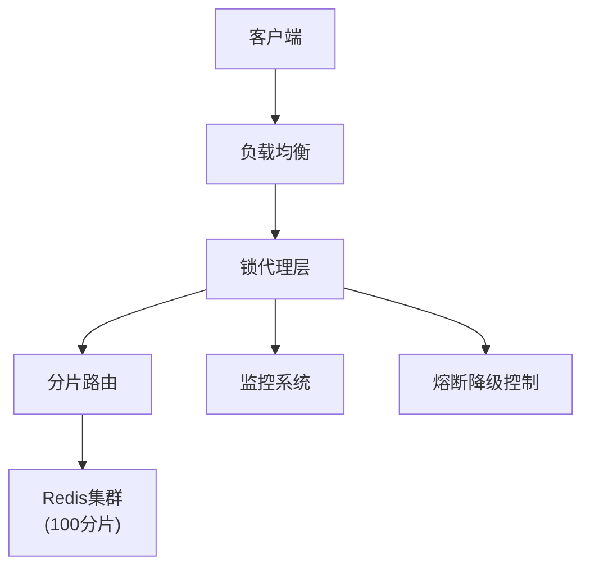
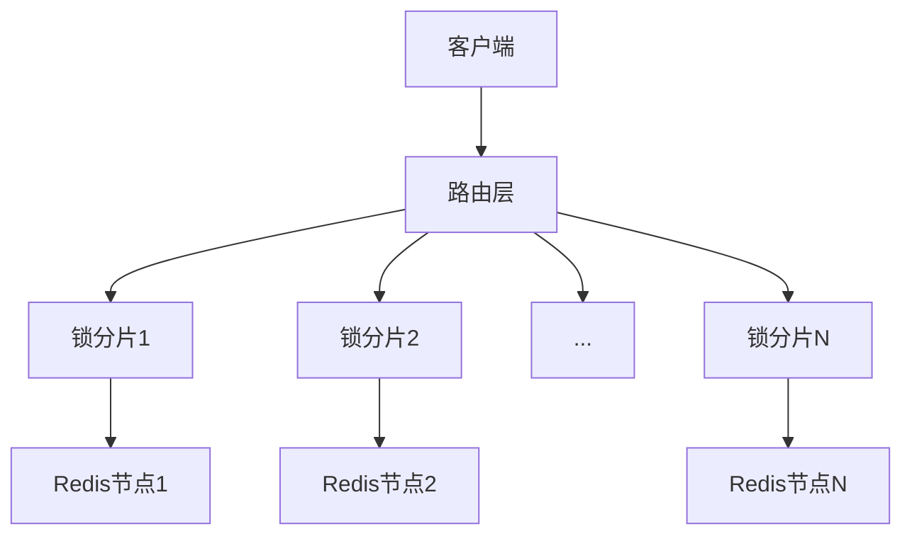
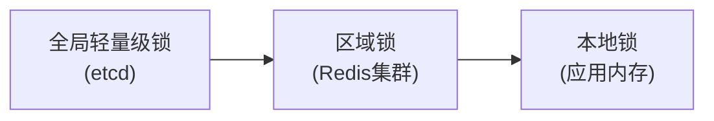
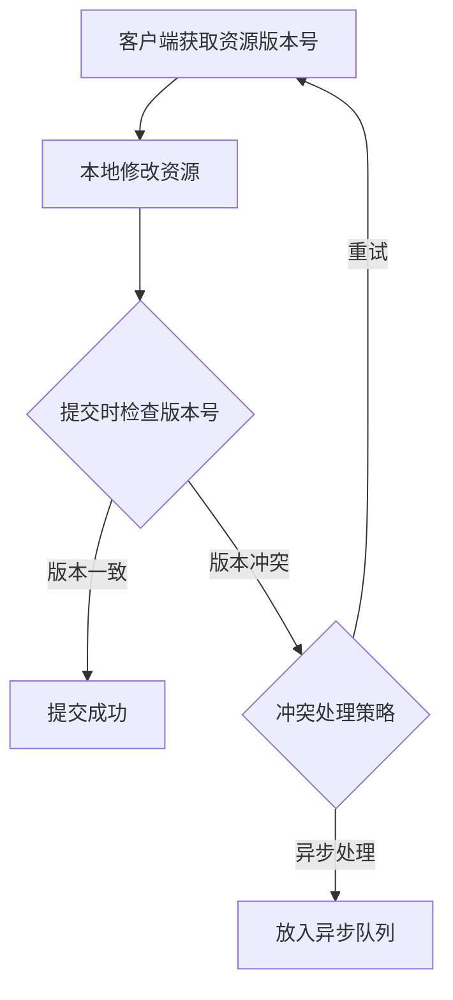

秒杀系统是高并发场景中最具挑战性的系统之一，需要解决瞬时超高流量、资源竞争和数据一致性等问题。

**核心需求**是支持百万 [QPS](../../Backend/系统指标/QPS.md) 。


**设计原则**

- **分层解耦**：将系统分为接入层、应用层、服务层和数据层
- **读写分离**：读多写少，优先优化读性能
- **热点隔离**：将秒杀商品与其他业务隔离
- **无状态设计**：便于水平扩展


### 设计方案


**前端优化**

- **静态化页面**：秒杀页面尽可能静态化，减少后端请求
- **CDN加速**：静态资源部署在 CDN 上
- **按钮防重复点击**：前端JS控制提交频率
- **倒计时校准**：客户端与服务器时间同步
- **请求排队**：前端实现虚拟排队机制


**接入层设计**

- **负载均衡**：使用 LVS+Nginx 集群，支持水平扩展
- **限流措施**：
    - 令牌桶/漏桶算法限流
    - 用户级别限流（如每个 UID 每秒最多 5 次请求）
    - IP 级别限流
- **恶意请求过滤**：识别和拦截刷单请求


**应用层设计**

- **服务拆分**：独立秒杀服务，避免影响主业务
- **缓存预热**：提前加载热点数据到缓存
- **异步处理**：采用消息队列削峰填谷
- **热点数据缓存**：
    - 多级缓存（本地缓存+分布式缓存）
    - 缓存击穿防护（互斥锁、永不过期策略）


**库存管理**

- **预扣库存**：活动开始前将库存加载到 Redis
- **分布式锁**：保证库存扣减的原子性
    - Redis+Lua 脚本实现原子操作
    - 避免使用悲观锁，采用乐观锁
- **分段锁**：将库存拆分为多个段，减少竞争
- **库存回补**：超时未支付的订单释放库存


**订单处理**

- **异步下单**：请求进入消息队列后快速返回
- **订单去重**：用户维度防重复下单
- **批量处理**：合并数据库操作
- **分库分表**：按用户 ID 哈希分片


**数据层优化**

- **数据库选择**：
    - 读多写少：Redis 集群 + MySQL 集群
    - 写密集型：考虑 TiDB 等分布式数据库
- **读写分离**：主库写，多个从库读
- **SQL优化**：简单查询，避免复杂 JOIN
- **连接池优化**：合理配置连接数


**容灾与降级**

- **熔断机制**：异常时快速失败
- **降级策略**：
    - 读降级：返回缓存数据或静态页面
    - 写降级：关闭非核心功能
- **预案演练**：定期进行压力测试和故障演练


**监控与告警**

- 全链路监控：从前端到数据库的每个环节
- 关键指标监控：QPS、RT、错误率、库存量等
- 实时告警：设置合理的阈值


### 支持百万 QPS 的分布式锁

**高并发场景下应尽量避免使用分布式锁**，尤其是传统的基于 Redis 或 ZooKeeper 的分布式锁（如 `Redisson` 或 `Curator`），因为它们无法承受百万级 QPS 的压力。

1. **性能瓶颈**：
    - Redis 单节点吞吐量约 10 万 QPS（集群模式下，锁竞争仍会集中在特定分片）。
    - ZooKeeper 写性能更差（约 1万 QPS），且强一致性协议（ZAB）会进一步降低并发能力。
2. **网络开销**：
    - 获取锁需要多次网络往返（如 Redis 的 `SETNX` + `EXPIRE` ）。
3. **竞争热点**：
    - 所有请求争抢同一把锁（例如商品库存锁），形成单点瓶颈。


**设计原则**

- **避免集中式锁竞争**：传统分布式锁在百万 QPS 下会成为单点瓶颈
- **分区化设计**：将锁请求分散到多个节点
- **无锁优先**：尽可能使用无锁或乐观锁方案
- **轻量级实现**：最小化锁操作的开销




#### 设计方案

##### 方案一：分片锁（Sharded Lock）



- **实现方式**：
    - 根据锁名称计算哈希值，路由到不同的锁分片
    - 每个分片由独立的 Redis 节点处理
    - 每个分片可支持约10万 QPS，100个分片即可支持百万 QPS

- **优化点**：
    - 使用 CRC32 等高效哈希算法
    - 分片数量可动态调整
    - 客户端缓存分片路由信息


##### 方案二：分层锁（Hierarchical Lock）



- **实现方式**：
    - 第一层：全局协调(低频率)
    - 第二层：区域锁(中等频率)
    - 第三层：本地应用锁(高频率)

- **适用场景**：
    - 需要强一致性的场景
    - 锁持有时间较长的场景


##### 方案三：乐观锁+异步提交



- **优势**：
    - 完全避免锁竞争
    - 适用于读多写少场景

#### 关键技术实现

##### Redis 集群优化

```lua
-- 改进版分布式锁Lua脚本
local key = KEYS[1]
local request_id = ARGV[1]
local ttl = tonumber(ARGV[2])
local retry_count = 0
local max_retry = 3

while retry_count < max_retry do
    if redis.call('setnx', key, request_id) == 1 then
        redis.call('pexpire', key, ttl)
        return 1
    elseif redis.call('ttl', key) == -1 then
        redis.call('pexpire', key, ttl)
    end
    retry_count = retry_count + 1
    -- 指数退避
    local sleep_time = math.min(100 * 2^retry_count, 1000)
    redis.call('sleep', sleep_time/1000)
end
return 0
```


##### 基于 Raft 的分布式锁服务

```
Lock Service
├── Leader Node
├── Follower Node 1
├── Follower Node 2
└── Follower Node 3
```

- **特点**：
    - 强一致性保证
    - 通过批处理和流水线提高吞吐量
    - 每个节点处理部分锁请求


#### 替代方案

##### 方案一：**无锁化设计**（最优解）

使用 Redis + Lua 脚本原子操作，将库存扣减逻辑封装成 Lua 脚本，**利用 Redis 的单线程特性**保证原子性。

```lua
-- KEYS[1]: 库存key, ARGV[1]: 扣减数量
local stock = tonumber(redis.call('GET', KEYS[1]))
if stock >= tonumber(ARGV[1]) then
    return redis.call('DECRBY', KEYS[1], ARGV[1])
else
    return -1
end
```

- **优势**：无锁竞争，单节点可达 10万+ QPS，集群模式下通过分片可横向扩展。
- **适用场景**：库存扣减、计数器等简单操作。


##### 方案二：**分段锁**（减少竞争）

将库存拆分为多个段（如 100 个段），每个段独立扣减。

```java
// 原始库存key: "stock_123" → 分段key: "stock_123_segment_0" ~ "stock_123_segment_99"
String segmentKey = "stock_123_segment_" + (userId % 100);
// 使用Lua脚本扣减分段库存
```


##### 方案三：**本地锁 + 分布式协调**（最终一致性）

应用层本地锁（如 Java 的 `ReentrantLock`）先处理，再异步同步到分布式存储：
1. 本地内存扣减库存
2. 发送消息队列
3. 消费者持久化到 DB。

- **优势**：完全避免分布式锁，性能极高。
- **代价**：需要容忍短暂不一致（通过库存预扣和超时释放保证最终一致）。